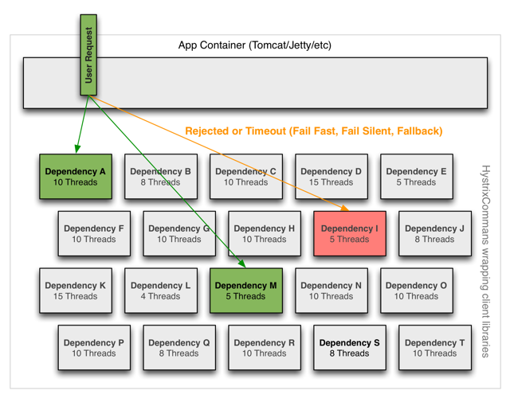
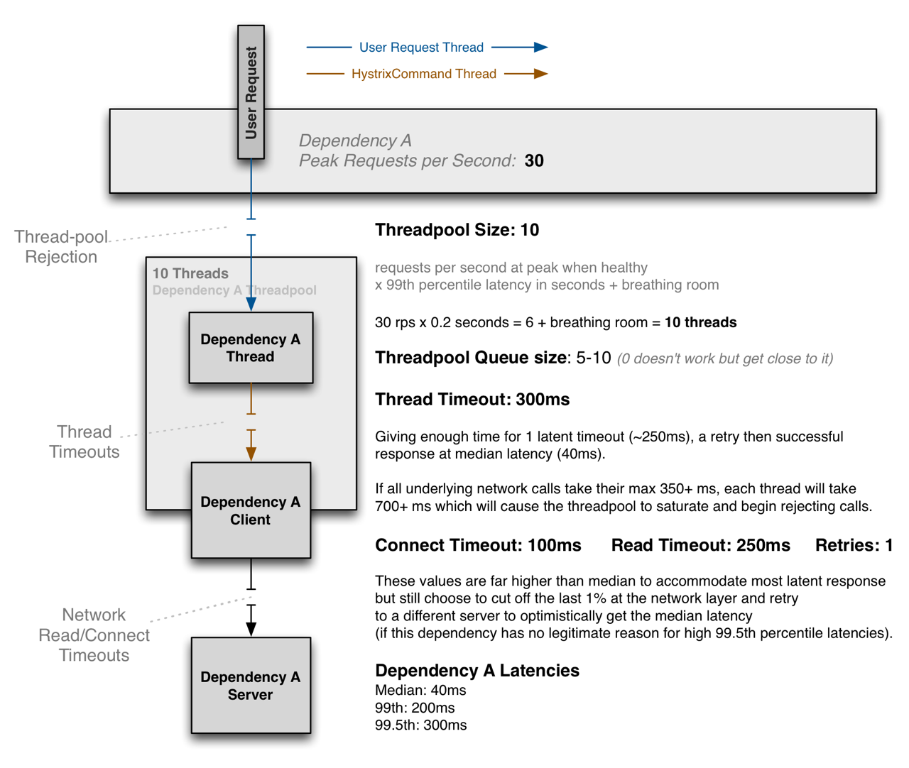

## 들어가기

안녕하세요. [배민FRESH](https://www.baeminfresh.com/) 서비스를 개발하고 있는 조건희입니다.

오늘은 API Gateway를 사용하면서 겪은 뼈아픈(?) 장애 사례와 해결 과정을 간단히 공유하고자 합니다. 너무 자세하게 쓰지는 않았습니다. 관련된 링크를 충분히 공유하오니 양해 부탁드립니다.

## 문제상황

어느날 저녁 평소보다 많은 트래픽이 갑자기 유입됩니다. 보통 마케팅이나 푸시 일정이 공유되지만, 이날은 예고 없이 찾아왔습니다.


그림 1. 요청수 추이

그런데 이 중에서 꽤 많은 비율로 [502 Bad Gateway](https://developer.mozilla.org/ko/docs/Web/HTTP/Status/502) 응답이 발생합니다. (어흑)


그림 2. 요청수와 502 응답수 추이

어디서 502를 응답한 걸까요? 확인해 보니 저희가 사용하고 있던 API Gateway에서 발생했네요. 더 이상 문제가 지속되지는 않았지만, 원인 분석과 추가 조치가 필요해 보였습니다. 마침 그날은 앞으로 API Gateway를 담당하게 될 거라고 전달 받은 날이었습니다. 잘됐다 싶었죠. 확인해 보겠다고 했습니다.

## 문제파악

API Gateway는 왜 502를 응답했을까요? 문제를 좀 더 이해하고 싶었구요. 그래서 502 원인을 추적하기 시작했습니다. 가장 먼저, 502를 응답한 URL들을 통계 내어 살펴봤습니다. 별다른 특이사항이 보이지 않네요. 다음으로는 서버 로그를 살폈습니다. Root Cause Exception에 다음과 같은 메시지가 보입니다.

```
Caused by: java.lang.RuntimeException: could not acquire a semaphore for execution
```

처음 보는 메시지입니다. 일단, 예외가 발생한 지점의 코드를 열어 봤습니다. 코드는 많이 단순화 시켰으니 주의하세요 :)

```java
if (circuitBreaker.allowRequest()) {
    final TryableSemaphore executionSemaphore = getExecutionSemaphore();
    if (executionSemaphore.tryAcquire()) {
    } else {
        // 이 내부에서 예외를 발생시키고 있었습니다.
        return handleSemaphoreRejectionViaFallback();
	}
}
```

`executionSemaphore.tryAcquire()`가 `false`를 반환해서 발생한 거군요. 참고로, 저희는 API Gateway로 [Spring Cloud Netflix](http://cloud.spring.io/spring-cloud-netflix/)의 [Zuul](https://github.com/Netflix/zuul/wiki)을 사용하고 있습니다. `getExecutionSemaphore` 부분의 코드도 잠깐 살펴봤습니다.

```java
protected TryableSemaphore getExecutionSemaphore() {
    if (properties.executionIsolationStrategy().get() ==
            ExecutionIsolationStrategy.SEMAPHORE) {
        return executionSemaphore;
    } else {
        // return NoOp implementation since we're not using SEMAPHORE isolation
        return TryableSemaphoreNoOp.DEFAULT;
    }
}
```

그리고 여기서 발생한 예외를 [ZuulFilter](http://netflix.github.io/zuul/javadoc/zuul-core/com/netflix/zuul/ZuulFilter.html)의 구현체인 [RibbonRoutingFilter](https://github.com/spring-cloud/spring-cloud-netflix/blob/master/spring-cloud-netflix-core/src/main/java/org/springframework/cloud/netflix/zuul/filters/route/RibbonRoutingFilter.java)가 잡아서 502 응답으로 변환하고 있네요.

그렇습니다. 저는 평범한 개발자입니다. 이 코드만을 보고 해결책을 찾아낼리가 없죠. 하지만 적어도 502는 [Hystrix](https://github.com/Netflix/Hystrix/wiki)가 만든 것이고, RibbonRoutingFilter에서 HystrixRuntimeException을 처리한 결과임은 알 수 있었습니다.

## Hystrix 이해

현재 저희 API Gateway는 3가지 라이브러리를 사용하고 있습니다.

1. [Zuul](https://github.com/Netflix/zuul) (Intelligent Routing)
2. [Ribbon](https://spring.io/guides/gs/client-side-load-balancing/) (Client Side Load Balancing)
3. [Hystrix](https://github.com/Netflix/Hystrix/wiki) ([Circuit Breaker](http://martinfowler.com/bliki/CircuitBreaker.html))

그 중에서도 예외를 발생시킨 라이브러리는 Hystrix 였구요. 따라서, 이 녀석에 대해 좀 더 살펴보기로 했습니다. 다음은 Hystrix에 대한 간단한 설명입니다.

> In a distributed environment, inevitably some of the many service dependencies will fail. Hystrix is a library that helps you control the interactions between these distributed services by adding latency tolerance and fault tolerance logic. Hystrix does this by isolating points of access between the services, stopping cascading failures across them, … (중략)
>
> \- [Hystrix Wiki, What is Hystrix?](https://github.com/Netflix/Hystrix/wiki)  

요약하면 이렇습니다.

“장애 내성<sup>fault tolerance</sup>과 지연 내성<sup>latency tolerance</sup>를 가진, 분산되어 있는 서비스들 간의 통신을 돕는 라이브러리”

[Spring Getting Strated, Circuit Breaker](https://spring.io/guides/gs/circuit-breaker/)에서는 Hystrix를 Circuit Breaker 구현체라고 소개하기도 합니다. 그리고 [Hystrix, How it Works](https://github.com/Netflix/Hystrix/wiki/How-it-Works) 문서는 Hystrix의 내부 동작을 잘 설명하고 있는데요. 여기서 아래의 순서도를 만날 수 있습니다.


그림 3. Hystrix Command 동작 순서도

어? 그런데 이 그림에서 4번, 5번이 유독 눈에 들어오네요. 저는 반가웠습니다. 왜냐구요? 위에서 살펴봤던 코드를 그대로 표현하고 있기 때문이었죠. ~~저만 반가운 건 함정.~~

## Isolation 이해
이번에는 `application.yml` 파일을 살펴봤습니다. 저희가 Hystrix를 어떻게 설정하고 있나 궁금했기 때문입니다.

```yaml
zuul.ribbonIsolationStrategy: SEMAPHORE
```

어라, 또 한 번 반갑지 않으신가요? 이것도 위에서 살펴봤던 코드와 관련 있구요. 그림 3의 5번 부분이기도 합니다. 아무래도 격리 전략<sup>Isolation Strategy</sup>을 살펴 봐야겠다고 느꼈습니다. 이 때, [Hystrix, How it Works](https://github.com/Netflix/Hystrix/wiki/How-it-Works#isolation)를 주로 참고했구요. 한 문장으로 정리하면 다음과 같습니다.

"일종의 [Bulkhead](https://skife.org/architecture/fault-tolerance/2009/12/31/bulkheads.html)이며, 각 서비스에 대한 의존성을 격리하고 동시 접근을 제한한다."



그림 4. Hystrix Isolation

위 그림은 Hystrix가 어떻게 의존 서비스들을 격리하는지 보여줍니다. 빨간색으로 표기된 네모 박스는 특정 서비스의 호출이 지연되고 있다는 뜻인데요. 나머지 서비스에는 영향을 주지 않고 있습니다. 또한, 동시 접근 제한을 서비스별로 다르게 설정하고 있습니다.

격리의 방법으로는 2가지가 존재합니다.

1. [Thread & Thread Pools](https://github.com/Netflix/Hystrix/wiki/How-it-Works#threads--thread-pools)
2. [Semaphore](https://github.com/Netflix/Hystrix/wiki/How-it-Works#semaphores) (Counter라고 표현하기도 하는데, 개인적으로는 이 용어가 더 와닿습니다)

**Thread** 방식에서는 서비스 호출이 별도의 스레드에서 수행됩니다. 예컨대, Tomcat의 스레드 풀과 서비스에 대한 호출 스레드가 격리되는 거죠. 이렇게 하면 네트워크 상의 타임아웃 위에 스레드 타임아웃을 둘 수 있습니다. 하지만 별도의 스레드를 사용하는 만큼 비용이 수반됩니다. [여기](https://github.com/Netflix/Hystrix/wiki/How-it-Works#drawbacks-of-thread-pools)서는 이를 가리켜 연산 오버헤드<sup>computational overhead</sup>라고 표현하네요.

한편, **Semaphore** 방식에서는 서비스 호출을 위해 별도의 스레드를 만들지 않습니다. 단지 각 서비스에 대한 동시 호출 수를 제한할 뿐입니다. 위에서 살펴봤던 코드 덕분에, 내용을 좀 더 쉽게 이해할 수 있었습니다. 아래 그림은 **Thread**와 **Semaphore**의 차이를 보여줍니다.


그림 5. Thread와 Semaphore의 격리 방식

## Isolation 권장사항
위에서 살펴봤던 코드 중에 `executionSemaphore.tryAcquire()` 부분이 있습니다. 여기 코드를 좀 더 살펴보면, `HystrixPropertiesManager.EXECUTION_ISOLATION_SEMAPHORE_MAX_CONCURRENT_REQUESTS`를 만나게 되는데요. 이는 `execution.isolation.semaphore.maxConcurrentRequests` 프로퍼티에 대응하는 상수입니다. 처음에는 이 수치를 좀 더 늘리려고 했습니다. 왜냐면 기존에 `SEMAPHORE`를 격리 전략으로 사용하고 있었구요. 여기서 **Semaphore** 구간에 진입할 수 있는 요청의 수만 늘려주면, API Gateway의 동시 처리량이 늘어날테고, 그러면 502 발생 가능성이 줄어드리라 생각했기 때문입니다. 프로퍼티에 대한 설명은 [여기](https://github.com/Netflix/Hystrix/wiki/Configuration#executionisolationsemaphoremaxconcurrentrequests)를 참고하세요.

하지만 [Hystirx Configuration 문서](https://github.com/Netflix/Hystrix/wiki/configuration#execution.isolation.strategy)를 좀 더 살펴보면, 아래와 같은 내용이 있습니다.

> The default, and the recommended setting, is to run HystrixCommands using thread isolation (중략)  
>
> Commands executed in threads have an extra layer of protection against latencies beyond what network timeouts can offer.  
>
> Generally the only time you should use semaphore isolation for HystrixCommands is when the call is so high volume (hundreds per second, per instance) that the overhead of separate threads is too high; this typically only applies to non-network calls.  

`HystrixCommand`를 사용할 때는 **Thread** 격리를 권장한다는 내용입니다. (서비스 호출의) 지연으로부터 보호되는 별도의 계층을 가질 수 있으니까요. 그리고 **Semaphore**를  써야하는 경우는 유일하다고 합니다. ~~꽤나 강력한 어조네요. 의구심이 생길 만큼요.~~ 바로 “호출량이 너무 많아서 분리된 스레드의 사용이 주는 오버헤드가 큰 경우”이구요. 네트워크 요청이 발생하지 않는<sup>non-network call</sup> 경우가 보통 여기에 해당한다고 합니다.

조금 더 문서와 코드를 들여다보고 운영을 하다 보면, 생각이 바뀔지도 모르겠습니다. 하지만 지금은 이 권장사항을 따르기로 했습니다. [Netflix API도 아주 일부만 **Semaphore**를 사용한다고 합니다](https://github.com/Netflix/Hystrix/wiki/Configuration#thread-or-semaphore). 인메모리 캐시에서 메타 데이터를 가져오거나, **Thread** 방식에 대한 퍼사드<sup>facade</sup>에 한해서요. 참고로, 저희 팀에서 기존에 **Semaphore**가 선택된 이유는 성능 테스트 결과가 더 좋았기 때문이라고 합니다. 하지만 이 테스트를 좀 더 살펴보니, 위에서 말하는 “네트워크 요청이 발생하지 않는 경우”였어요. 자신의 리소스만 사용한 경우죠.

## 성능 개선 순서
지금까지 Hystrix는 무엇이고, 그 중에서도 격리가 무엇인지 살펴 보았습니다. 그리고 격리 전략은 **Thread**를 선택하기로 했구요. 이제는 부하 당시 만났던 502를 줄여나갈 차례입니다. 작업 순서를 요약하면 다음과 같습니다.

1. 부하 테스트 수행
2. 문제가 발생하는 부하 임계치 확인
3. 충분히 수용할 만한 임계치인지 판단
4. 임계치가 수용 가능하면, 다음 단계 생략하고 작업 종료
5. 임계치가 수용 불가하면, 임계치 높이기 위한 설정 조정
6. 1번 단계로 이동

*기본적으로 API Gateway의 동시 처리량과 TPS를 높이는 것이 목표입니다. 이것만으로 부족하다면, 스케일 아웃을 얼마나 해야 하는지 판단 근거를 마련하고자 했습니다.

## 설정 변경

TBD: 자바 성능 튜닝과학의 영역이 아니라 예술의 영역이다(책 문구 인용할 것). 그래도 테스트 해봐야지!

우선 프로덕션 환경과 유사한 테스트 환경을 마련했습니다. 서버 인스턴스는 물론, URL도 부하 당시의 것들을 사용했습니다. 부하가 특정 임계치에 다다르니 API Gateway가 502를 응답하기 시작하네요. 서버 로그에도 “could not acquire a semaphore for execution” 메시지가 찍힙니다.

여기서부터는 조금씩 Hystrix 설정을 바꿔가며 부하 임계치를 늘려나갔습니다. 처음에는 API Gateway가 병목이었는데요. 점차 의존 서비스들이 부하를 못 견디는 상황으로 바뀌었습니다. 이대로 만족할 수 없어서, 의존 서비스들의 인스턴스들을 추가 투입해가며, API Gateway의 성능을 개선해 나갔습니다.

결과적으로 변경한 설정 값은 아래의 5가지입니다. 참고로,  `zuul.ribbonIsolationStrategy`  설정값을 THREAD로 바꾸면, 기본적으로 모든 라우팅에 Hystrix의 스레드 풀이 사용됩니다. 관련 내용은 [Spring Cloud Netflix, How to Configure Hystrix thread pools](https://github.com/spring-cloud/spring-cloud-netflix/blob/master/docs/src/main/asciidoc/spring-cloud-netflix.adoc#how-to-configure-hystrix-thread-pools)을 참고하세요.

| 설정                                       | 내용                                |
| :--------------------------------------- | --------------------------------- |
| [zuul.ribbonIsolationStrategy](https://github.com/spring-cloud/spring-cloud-netflix/blob/master/docs/src/main/asciidoc/spring-cloud-netflix.adoc#router-and-filter-zuul) | Hystrix 격리 전략 (THREAD, SEMAPHORE) |
| [hystrix.threadpool.default.coreSize](https://github.com/Netflix/Hystrix/wiki/configuration#coresize) | Hystrix 스레드 풀의 기본 크기              |
| [hystrix.threadpool.default.maximumSize](https://github.com/Netflix/Hystrix/wiki/configuration#maximumSize) | Hystrix 스레드 풀의 최대 크기              |
| [allowMaximumSizeToDivergeFromCoreSize](https://github.com/Netflix/Hystrix/wiki/configuration#allowMaximumSizeToDivergeFromCoreSize) | Hystrix maximumSize 값을 사용하기 위한 설정 |
| [server.undertow.worker-threads](http://docs.spring.io/spring-boot/docs/current/api/org/springframework/boot/autoconfigure/web/ServerProperties.Undertow.html#setWorkerThreads-java.lang.Integer-) | undertow 서버의 스레드 풀 크기             |

그 외에도 아래 그림을 참고하여 커넥션 관련 설정을 조정해 주었습니다.



그림 6. Hystrix ThreadPool 설정 예시 (출처: [Hystrix Configuration, ThreadPool Properties](https://github.com/Netflix/Hystrix/wiki/configuration#threadpool-properties))

## 결과 비교

먼저 단순 TPS 수치를 비교했습니다. 기존 대비 약 4배 가량 성능이 개선되었네요. 동시 처리량도 늘어났구요. 이제 이 수치를 부하 당시에 대입해 보았습니다. 기존 처리량으로는 수치상으로도 확실히 부하를 견디지 못하겠네요. 하지만 개선 후에는 더 적은 수의 인스턴스로 더 많은 요청을 처리할 수 있습니다. 정말 다행입니다. 서비스가 열심히 홍보되서 사용자들이 유입됐는데, API Gateway가 이를 막아버리는 꼴이었으니까요. 요구사항을 만족시키지 못하는 기술이 무슨 의미가 있나요. 관리의 부담만 늘어나는 걸요.

## 정리하며
지금까지 서비스가 장애를 만난 상황, 부하를 일으킨 지점의 코드, Hystrix와 격리 전략, 개선 내용, 그리고 결과를 간략하게 살펴보았습니다. 사실 문서와 코드를 살펴보면서, 궁금한 부분들이 줄어들기는 커녕 늘어나기만 했습니다. 해야 할 일도 굉장히 많아 보였구요. 앞으로 꾸준히 문서와 코드를 뒤적거리며 공부해야 겠다고 느꼈습니다. 더 중요한 것은 API Gateway를 통해 우리가 해결하려는 문제입니다. 공부를 하다 보면 목적을 자주 잊어버리곤 하는데요. 우리가 왜 이 기술을 쓰는지, 정말 필요한 것인지, 다른 대안은 없는지 꾸준히 고민해야 하겠습니다.

부족한 글 읽어주셔서 감사합니다. 끗

