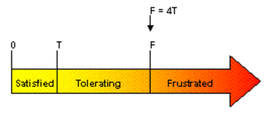
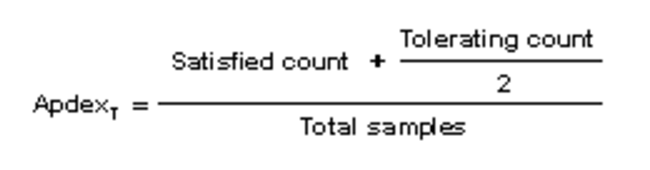
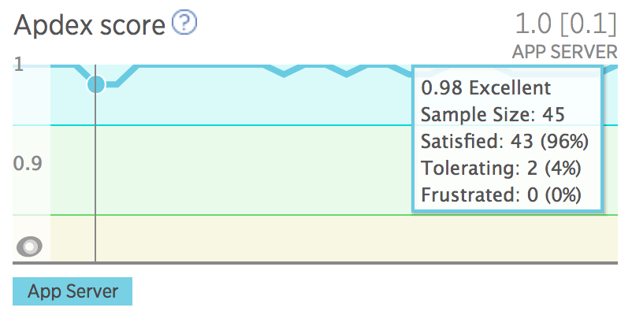

# NewRelic Apdex 설정하기

[NewRelic](https://newrelic.com/)의 주요 수치 중 하나로 [Apdex](http://www.apdex.org/) 라는 것이 있다. 이 글에서는 이 값이 무엇이고, 왜 필요하며, 어떻게 설정하는지 간단히 살펴본다.

## Apdex란?

ApdexApplication Performance Index는 웹 애플리케이션의 응답 시간에 대한 사용자의 만족도를 나타낸다. 이를 좀 더 잘 이해하기 위해, 반응성responsiveness의 3가지 수준을 먼저 살펴보자.

그림 1. Apdex 반응성 수준 (출처: http://apdex.org/overview.html)

각 수준에 대한 설명은 아래와 같다. (보다 자세한 내용은 [Apedx Overview](http://apdex.org/overview.html)를 참고)

| 응답 수준      | 구간            | 설명                              |
| ---------- | ------------- | ------------------------------- |
| Satisfied  | 0 ≥, T ≤      | 사용자가 응답 시간이 지연된다고 느끼지 않음.       |
| Tolerating | T >, F = 4T ≤ | 사용자가 응답 시간이 지연된다고 느끼지만 참을 만함.   |
| Frustrated | F >           | 사용자가 응답 시간을 용인하지 못하고 프로세스를 포기함. |

만약, T를 100ms라고 정의했다면, 응답 시간이 100ms 이내인 경우는 `Satisfied`, 100~400ms 구간은 `Tolerating`, 400ms 이상이면 `Frustrated` 수준이 된다.

이제 이 기준값을 가지고 아래와 같이 Apdex Score를 산출할 수 있다.

그림 2. Apdex 공식 (출처: http://apdex.org/overview.html)

간단히 예를 들어보자.

- 서버가 1분 동안 총 80개의 요청을 처리함.
- T 값을 100ms로 지정함.
- 70개의 요청은 100ms 이내의 응답 시간을 가짐.
- 2개의 요청은 200ms의 응답 시간을 가짐.
- Apdex 점수 = (70 + (2 / 2)) / 80 = 0.89

참고로, NewRelic에서는 에러 응답도 `Frustrated` 수준에 포함시키고 있다. [Apdex: Measuring user satisfaction](https://docs.newrelic.com/docs/apm/new-relic-apm/apdex/apdex-measuring-user-satisfaction#error)에서 이를 확인할 수 있다.

## 왜 설정하는가?

Apdex가 무엇인지는 알았다. 그런데 NewRelic에서 이 수치를 설정하는 것이 어떤 의미가 있는가?

그림 3. NewRelic의 Apdex 점수 모니터링 화면

모니터링 지표의 하나로 평균 응답 시간이 많이 사용된다. 이 수치는 물론 중요하다. 하지만 몇 가지 한계점들을 가지고 있다.

1. 일부 성능 아웃라이어performance outlier들에 의해 일반적 응답 시간이 왜곡됨. 그리고 이런 아웃라이어들은 존재하기 마련.
2. 평균 응답 시간으로는 얼마나 많은 사용자가 만족했고 좌절했는지를 나타내지 못함.
3. 애플리케이션마다 사용자가 용인할 수 있는 응답 시간이 다름. 애플리케이션 간의 표준화된 측정이 어려움.

개인적으로 3번은 관심의 대상이 아니므로, 여기서는 1번과 2번만을 설명한다. 먼저 아래 그림을 보자.

그림 4. 아웃라이어에 의해 왜곡된 평균 응답 시간 (출처: [Dynatrace: Why Averages Suck and Percentiles are Great](https://www.dynatrace.com/blog/why-averages-suck-and-percentiles-are-great/))

이 그림으로 보면 일반적인 응답 시간은 2~3이라는 것을 알 수 있다. 그런데 이를 평균으로 계산해 보면, `4.46 = (2+14+18+12+10+12+7+8+9+10+11+12) / 28`이 된다. 생각해보자. 4.46이라는 값은 애플리케이션의 일반적인 응답 시간을 잘 설명해 주는가? 평균값이 아닌 중위수median를 사용하면 어떨까 싶지만, 또 다른 한계를 만나게 된다. 그리고 이런 아웃라이어들은 주변에서 얼마든지 쉽게 만날 수 있다.

다음으로 2번에 대해 살펴보자. 어떤 애플리케이션이 평균적으로 `200ms`라는 응답 시간을 가진다고 할 때, 이 응답 시간은 느린 것인가 빠른 것인가? 또 얼마나 많은 사용자가 만족했는가? 혹은 사용자들이 얼마나 좌절감을 느끼고 있는가? 평균 응답 시간은 애플리케이션이 만족해야 하는 고유의 응답 시간을 말해주지 못한다. 또한 목표를 얼마나 만족시켰는지, 혹은 얼마나 만족시키지 못했는지를 설명하지 못한다.

Apdex를 사용하면 이런 한계들이 어느 정도 극복된다. 애플리케이션 고유의 응답 시간 목표를 설정할 수 있으며, 얼마나 많은 사용자들을 만족시켰고 좌절시켰는지를 0~1이라는 하나의 수치로 파악할 수 있게 해준다. 또한 NewRelic에서는 그림 3과 같이 Apdex 점수 추이는 물론, 몇 개의 요청이 목표를 달성했고 달성하지 못했는지를 잘 보여준다. 또한 [APM Transactions page](https://docs.newrelic.com/docs/apm/applications-menu/monitoring/transactions-page)에서 느린 트랜잭션(아웃라이어)이 좀 더 잘 노출된다. 그 외에도 [NewRelic Alerts](https://docs.newrelic.com/docs/alerts/new-relic-alerts)에서 Apdex 설정을 통해 좀 더 민감하게 알림을 받을 수 있기도 하다.

## 적용하기

적용 방법 자체는 정말 간단하다. [Change your Apdex settings](https://docs.newrelic.com/docs/apm/new-relic-apm/apdex/change-your-apdex-settings)을 보면 App server Apdex settings, End-user Apdex settings, Key transaction Apdex settings, Apdex alerting에 대한 설명이 잘 나와 있으니 참고하면 된다. 다만, 애플리케이션의 응답 시간 목표를 얼마로 잡아야 하는지 고민은 필요하다. 빠르면 빠를 수록 좋으나 Apdex T를 무조건 낮게 설정하면, 정상적인 응답들이 

사용자 입장에서야 빠르면 빠를 수록 좋겠지만, 애플리케이션의 복잡도나 기술적 한계 등을 생각하지 않을 수 없다. 

- [New Relic Blog: What should I set my Apdex goal to?](https://blog.newrelic.com/2011/01/21/what-should-i-set-my-apdex-goal-to/)
- ​

## 참고자료

- [Apdex Overview](http://apdex.org/overview.html)
- [New Relic Blog: What should I set my Apdex goal to?](https://blog.newrelic.com/2011/01/21/what-should-i-set-my-apdex-goal-to/)
- [New Relic Documents: Measuring user satisfaction](https://docs.newrelic.com/docs/apm/new-relic-apm/apdex/apdex-measuring-user-satisfaction#error)
- [New Relic Documents: View your Apdex score](https://docs.newrelic.com/docs/apm/new-relic-apm/apdex/view-your-apdex-score)
- [New Relic Documents: Change your Apdex settings](https://docs.newrelic.com/docs/apm/new-relic-apm/apdex/change-your-apdex-settings)
- [Dynatrace: Why Averages Suck and Percentiles are Great](https://www.dynatrace.com/blog/why-averages-suck-and-percentiles-are-great/)

